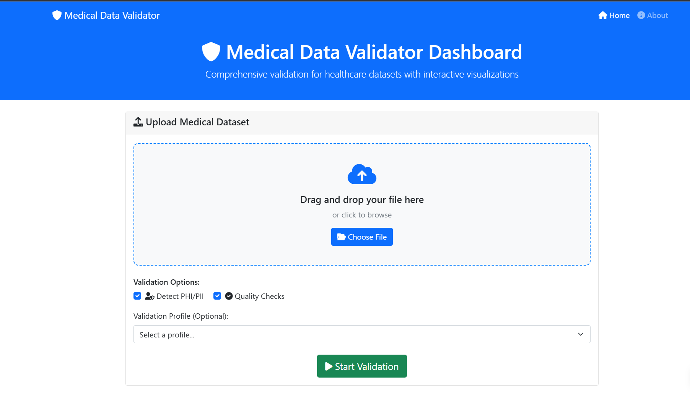
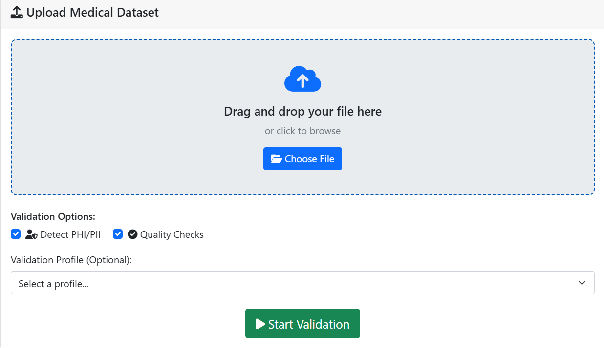
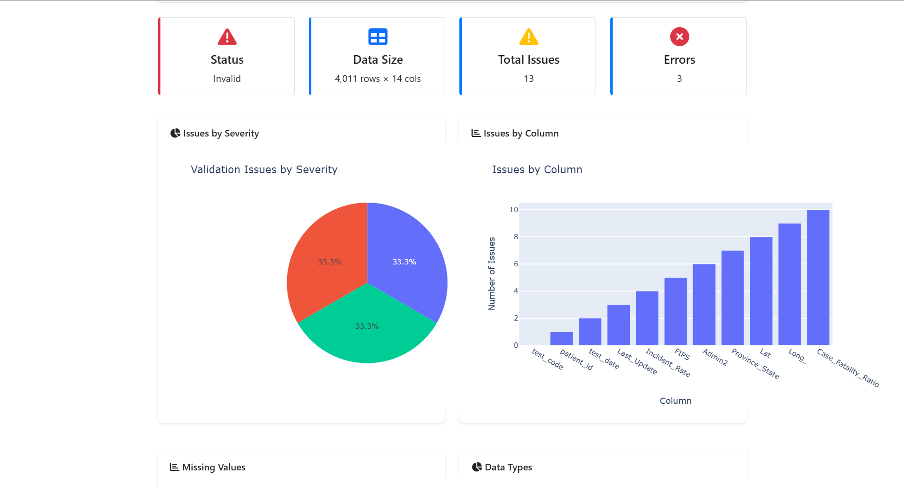
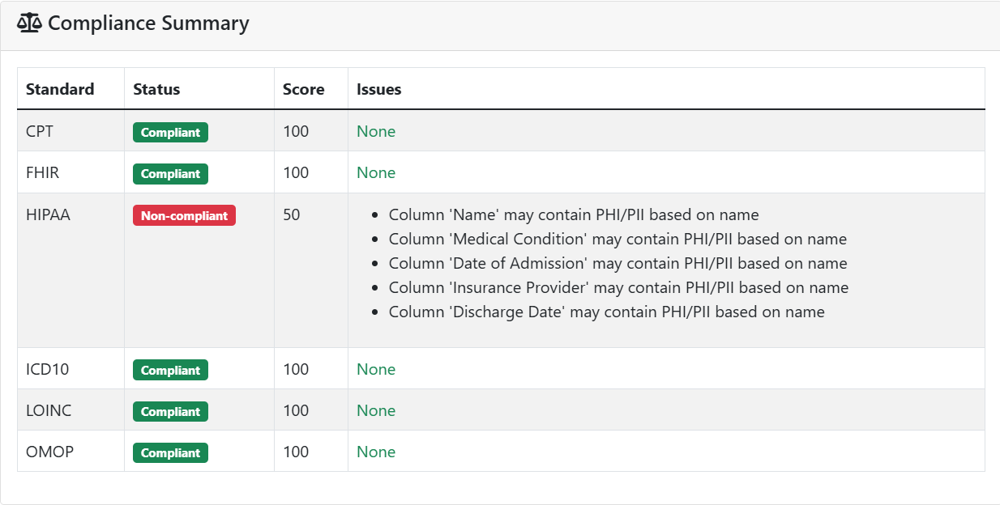
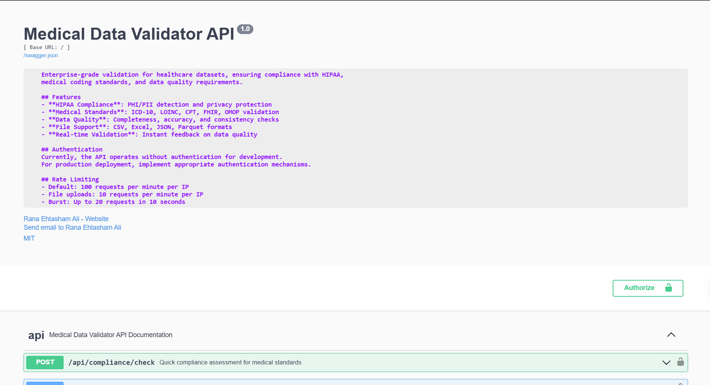
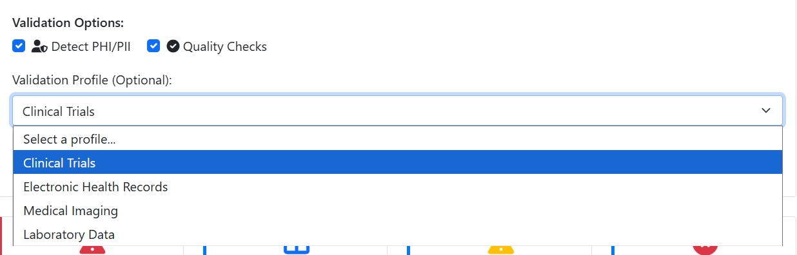
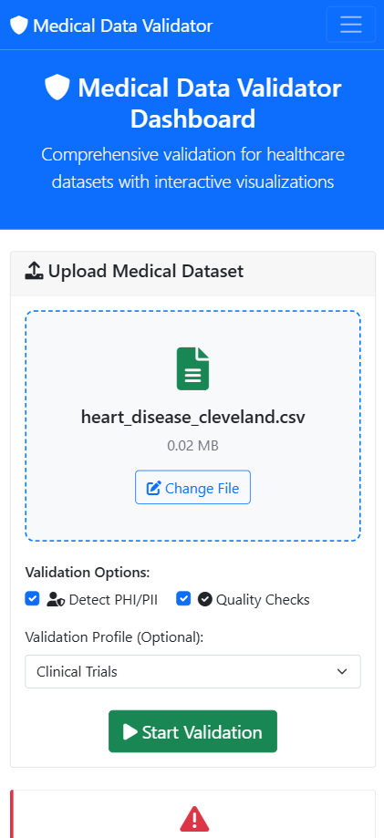

# Medical Data Validator - UI Preview

## Overview

The Medical Data Validator provides a modern, intuitive web interface for validating healthcare datasets. The UI is designed with healthcare professionals in mind, offering both simplicity for casual users and advanced features for power users.

## Main Dashboard

### Home Screen

**Features:**
- **Quick Start**: Drag-and-drop file upload with instant validation
- **Recent Validations**: History of recent validation sessions
- **Validation Profiles**: Pre-configured profiles for different use cases
- **Real-time Status**: Live validation progress and results

### Key Elements:
- **File Upload Zone**: Large, prominent drag-and-drop area
- **Profile Selector**: Dropdown for clinical trials, EHR, imaging, lab data
- **Settings Panel**: Advanced validation options
- **Results Preview**: Immediate feedback on validation status

## File Upload Interface

### Upload Screen

**Features:**
- **Multi-format Support**: CSV, Excel, JSON, Parquet files
- **Batch Processing**: Upload multiple files simultaneously
- **Progress Tracking**: Real-time upload progress with validation status
- **File Preview**: Preview file contents before validation

### Supported Formats:
- **CSV**: Comma-separated values with medical data
- **Excel**: .xlsx and .xls files with multiple sheets
- **JSON**: Structured medical data in JSON format
- **Parquet**: High-performance columnar data format

## Validation Results

### Results Dashboard

**Features:**
- **Compliance Score**: Overall compliance percentage with visual indicators
- **Issue Breakdown**: Categorized issues by severity (Error, Warning, Info)
- **Standard Compliance**: Individual compliance scores for each medical standard
- **Export Options**: Download detailed reports in PDF, CSV, or JSON

### Results Components:
- **Summary Cards**: Key metrics at a glance
- **Issue List**: Detailed list of validation issues with locations
- **Compliance Matrix**: Visual representation of standards compliance
- **Action Items**: Suggested fixes for identified issues

## Compliance Reports

### Detailed Compliance View

**Features:**
- **HIPAA Compliance**: Detailed HIPAA compliance analysis
- **Medical Standards**: ICD-10, LOINC, CPT code validation
- **Data Quality**: Completeness, accuracy, and consistency checks
- **Security Assessment**: PHI/PII detection and security recommendations

### Report Sections:
- **Executive Summary**: High-level compliance overview
- **Detailed Analysis**: Per-standard compliance breakdown
- **Risk Assessment**: Identified risks and mitigation strategies
- **Recommendations**: Actionable improvement suggestions

## API Documentation Interface

### Interactive API Docs

**Features:**
- **Interactive Testing**: Test API endpoints directly from the browser
- **Request Builder**: Visual interface for building API requests
- **Response Examples**: Sample requests and responses for each endpoint
- **Authentication Guide**: Step-by-step authentication setup

### API Features:
- **Endpoint Explorer**: Browse all available API endpoints
- **Schema Validation**: Automatic request/response validation
- **Rate Limit Display**: Real-time rate limit information
- **Error Handling**: Comprehensive error code documentation

## Settings & Configuration

### Advanced Settings

**Features:**
- **Validation Profiles**: Create and manage custom validation profiles
- **Security Settings**: Configure PHI detection and data handling
- **Export Preferences**: Set default export formats and options
- **API Configuration**: Manage API keys and access settings

### Configuration Options:
- **Profile Management**: Save and load validation configurations
- **Security Policies**: Set data retention and anonymization policies
- **Notification Settings**: Configure email and webhook notifications
- **Integration Setup**: Connect with external systems and databases

## Mobile Responsive Design

### Mobile Interface

**Features:**
- **Touch-Optimized**: Large touch targets for mobile devices
- **Responsive Layout**: Adapts to different screen sizes
- **Offline Support**: Basic validation without internet connection
- **Progressive Web App**: Install as native app on mobile devices

### Mobile Capabilities:
- **Camera Upload**: Upload files directly from device camera
- **Voice Commands**: Voice-activated file upload and validation
- **Push Notifications**: Real-time validation completion alerts
- **Offline Mode**: Basic validation with cached standards

## Accessibility Features

### Accessibility Support

**Features:**
- **Screen Reader Support**: Full compatibility with screen readers
- **Keyboard Navigation**: Complete keyboard-only operation
- **High Contrast Mode**: High contrast color schemes
- **Font Scaling**: Adjustable font sizes for readability

### Accessibility Standards:
- **WCAG 2.1 AA**: Full compliance with accessibility guidelines
- **Section 508**: Meets federal accessibility requirements
- **ARIA Labels**: Proper ARIA labeling for all interactive elements
- **Focus Management**: Clear focus indicators and logical tab order

## User Experience Highlights

### Intuitive Workflow
1. **Upload**: Simple drag-and-drop file upload
2. **Configure**: Select validation profile and options
3. **Validate**: Real-time validation with progress tracking
4. **Review**: Comprehensive results with actionable insights
5. **Export**: Download reports in preferred format

### Visual Design
- **Healthcare Theme**: Clean, medical-grade visual design
- **Color Coding**: Intuitive color system for severity levels
- **Icons**: Clear, recognizable icons for all functions
- **Typography**: Readable fonts optimized for medical data

### Performance
- **Fast Loading**: Optimized for quick page loads
- **Real-time Updates**: Live validation progress updates
- **Caching**: Intelligent caching for improved performance
- **Progressive Loading**: Load content as needed

## Browser Compatibility

### Supported Browsers
- **Chrome**: Version 90+ (Recommended)
- **Firefox**: Version 88+
- **Safari**: Version 14+
- **Edge**: Version 90+

### Mobile Browsers
- **iOS Safari**: iOS 14+
- **Chrome Mobile**: Android 8+
- **Samsung Internet**: Version 14+

## System Requirements

### Minimum Requirements
- **RAM**: 4GB available memory
- **Storage**: 100MB free disk space
- **Network**: Stable internet connection
- **Browser**: Modern web browser with JavaScript enabled

### Recommended Requirements
- **RAM**: 8GB available memory
- **Storage**: 500MB free disk space
- **Network**: High-speed internet connection
- **Browser**: Latest version of Chrome or Firefox

## Future Enhancements

### Planned Features
- **AI-Powered Validation**: Machine learning for improved accuracy
- **Real-time Collaboration**: Multi-user validation sessions
- **Advanced Analytics**: Detailed performance and usage analytics
- **Integration Hub**: Connect with EHR systems and databases

---

**Note**: These screenshots represent the planned UI design. Actual implementation may vary based on development progress and user feedback. 